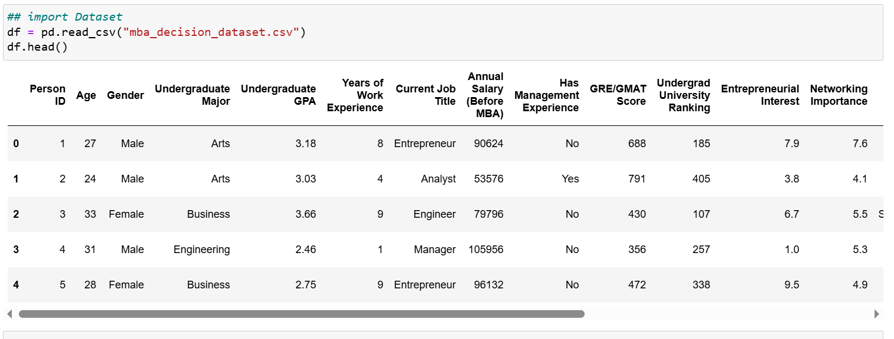
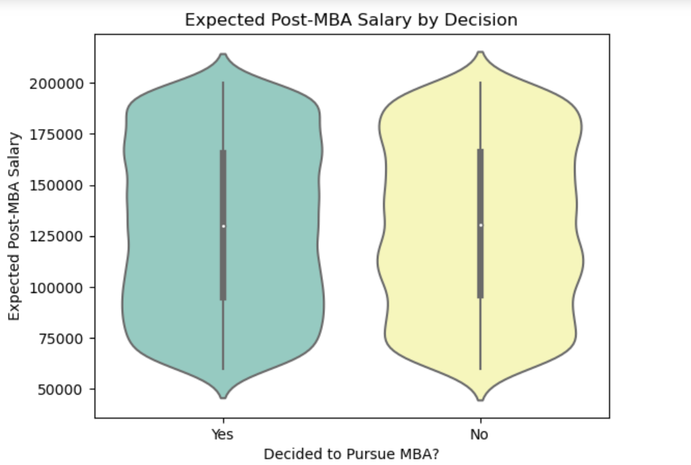

## MBA Decision Prediction Using Machine Learning

###  Project Title
"Will They Pursue an MBA?" — A Machine Learning Approach Aligned with SDG 4: Quality Education

### Objective
This project aims to build a predictive model that determines whether an individual is likely to pursue an MBA based on demographic, academic, and career-related features.

The goal aligns with UN Sustainable Development Goal 4 (Quality Education) by leveraging data-driven insights to understand access and motivation behind higher education decisions.

### Dataset Description

The dataset contains 10,000 entries with 20 features, including:

- Age, Gender, GPA, Work Experience
- GRE/GMAT scores, Salary (before/after MBA)
- Entrepreneurial interest, Networking importance
- MBA format, funding sources, and decision (Yes/No)

The target variable is: Decided to Pursue MBA?

### Tools & Technologies
Python (pandas, NumPy, matplotlib, seaborn)

Scikit-learn (Logistic Regression, Random Forest)

XGBoost

Imbalanced-learn (SMOTE)

Google Colab (for cloud-based execution)

### Machine Learning Process
Data Preprocessing

Encoding categorical variables

Feature scaling

SMOTE applied to handle class imbalance

Models Trained

Logistic Regression

Random Forest

XGBoost (Full dataset and Top 10 feature version)

Evaluation Metrics

Confusion Matrix

Precision, Recall, F1-score

Feature Importance Visualization

### Screenshots
A Screenshot on the datasets data

A ViolinPlot on the expect salary expectation post MBA


### Repo Structure
📦mba-decision-predictor
 ┣ 📜 README.md
 ┣ 📜 MBA_Model_Notebook.ipynb
 ┣ 📂 assets/
 ┃ ┣ 📸 visualizations.png
 ┃ ┗ 📸 confusion_matrix.png
 ┗ 📄 requirements.txt


### How to Run
1. Clone the repo:
```
git clone https://github.com/Fabian-Lewis/MBA-Model.git
cd mba-decision-predictor

```
2. Install dependencies:
```
pip install -r requirements.txt
```
3. Launch the notebook:
```
jupyter notebook MBA_Model_Notebook.ipynb
```
